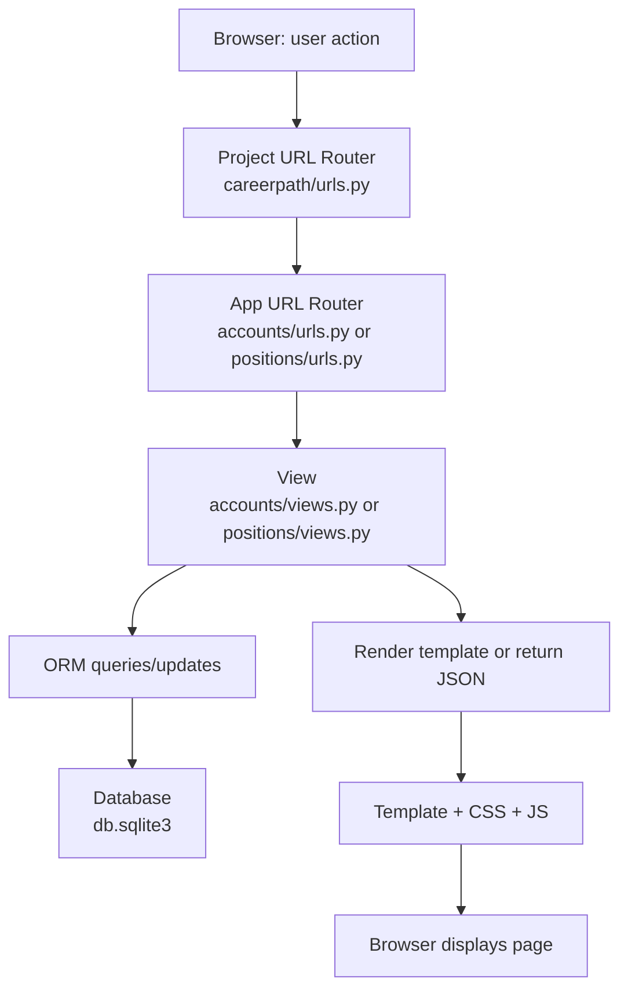

# Career Optimizer — Developer Guide

**Purpose**  
This document explains how to get the project running locally, where the important files live, and how the core parts work. It is written step-by-step so a developer (or a student developer) can follow, inspect, and extend the application safely.

---

## Introduction - how the project works (high level)

Career Optimizer is a Django web application that helps students record skills and proficiencies, compare their skills to position requirements, save positions, and generate a CV.

At runtime the application follows a simple request → process → response flow:

1. A user (student or admin) interacts with the browser UI (clicks, submits a form, requests a page)
2. The browser sends an HTTP request to the Django application
3. Django routing (`careerpath/urls.py` → app `urls.py`) dispatches the request to a view
4. The view uses the Django ORM to read or update models in the database (`db.sqlite3` in development)
5. The view prepares a context and renders an HTML template (or returns JSON for AJAX endpoints)
6. The template combined with CSS/JS produces the final UI shown in the browser

The project stores application data in models such as `User`, `StudentProfile`, `StudentSkill`, `Skill`, `Position`, and `PositionSkillRequirement`. The key business feature - matching a student to a Position - is computed from saved student skills and the position's skill requirements and importance weights.

---

## Flow diagrams

### Mermaid flowchart (works on GitHub when Mermaid is enabled)



> If Mermaid diagrams are not supported in the viewing environment, use the ASCII fallback below.

### ASCII fallback (plain text)

```
[Browser: user action]
        |
        v
[careerpath/urls.py] --> [accounts/urls.py or positions/urls.py]
        |
        v
[view: accounts/views.py or positions/views.py]
        |
        v
[ORM] <--> [db.sqlite3]
        |
        v
[render(template) or JsonResponse]
        |
        v
[HTML + CSS + JS sent to Browser]
```

---

## Table of contents

- [Quick start (fastest)](#quick-start-fastest)
- [Full setup (step-by-step)](#full-setup-step-by-step)
- [Repository map (exact top-level items)](#repository-map-exact-top-level-items)
- [Key configuration to check (careerpath/settings.py)](#key-configuration-to-check-careerpathsettingspy)
- [Database - where it lives and how it behaves](#database---where-it-lives-and-how-it-behaves)
- [Models - concise, accurate, file-by-file](#models---concise-accurate-file-by-file)
- [Views, URLs, Templates - how a page is produced (step-by-step)](#views-urls-templates---how-a-page-is-produced-step-by-step)
- [Match scoring - exact behaviour (from code)](#match-scoring---exact-behaviour-from-code)
- [Styling & static files - how CSS is applied](#styling--static-files---how-css-is-applied)
- [Admin, shell & commonly used commands](#admin-shell--commonly-used-commands)
- [Troubleshooting - common problems & fixes](#troubleshooting---common-problems--fixes)
- [Handover checklist & recommended first tasks](#handover-checklist--recommended-first-tasks)

---

## Quick start (fastest)

> Use this only if you provide `requirements.txt` and `db.sqlite3` to the incoming developer. This gets a working local instance up quickly.

**Windows (PowerShell)**
```powershell
python -m venv venv
venv\Scripts\activate
pip install -r requirements.txt
python manage.py runserver
```

**mac/Linux**
```bash
python -m venv venv
source venv/bin/activate
pip install -r requirements.txt
python manage.py runserver
```

Open in browser:
- http://127.0.0.1:8000
- http://127.0.0.1:8000/admin

If `db.sqlite3` is **not** provided, run migrations before starting the server:
```bash
python manage.py migrate
```

To create an admin account:
```bash
python manage.py createsuperuser
```

---

## Full setup (step-by-step)

Follow this when `db.sqlite3` is not supplied or to reproduce the environment from scratch.

1. **Clone repo and enter directory**
   ```bash
   git clone <repo-url>
   cd career-optimizer--project
   ```

2. **Create and activate virtual environment**
   
   Windows PowerShell:
   ```powershell
   python -m venv venv
   .\venv\Scripts\Activate.ps1
   ```
   
   mac/Linux:
   ```bash
   python -m venv venv
   source venv/bin/activate
   ```

3. **Install dependencies**
   ```bash
   pip install -r requirements.txt
   ```

4. **Inspect and optionally update settings** (see the next section on details)
   
   If you want a project-level `static/` folder discovered during development add to `settings.py`:
   ```python
   STATICFILES_DIRS = [BASE_DIR / "static"]
   ```

5. **Create and apply migrations**
   ```bash
   python manage.py makemigrations
   python manage.py migrate
   ```

6. **Create a superuser (optional)**
   ```bash
   python manage.py createsuperuser
   ```

7. **Start the development server**
   ```bash
   python manage.py runserver
   ```

8. **Verify in browser**
   - http://127.0.0.1:8000
   - http://127.0.0.1:8000/admin

---

## Repository map (exact top-level items)

Top-level items present in the repository snapshot:

```
.venv
.vscode
accounts
careerpath
positions
templates
venv
.gitignore
db.sqlite3
db.sqlite3.bak
index.html
manage.py
README.md
requirements.txt
structure.txt
```

**Notes**
- `.venv` and `venv` are virtual environment directories (should be ignored by Git)
- `db.sqlite3` and `db.sqlite3.bak` are database files
- `templates/` contains base templates (`base.html`, `base_auth.html`, `landing.html`)

---

## Key configuration to check (`careerpath/settings.py`)

Open `careerpath/settings.py` and verify these values:

**Custom user model**
```python
AUTH_USER_MODEL = 'accounts.User'
```
- The project uses a custom `User` model
- Do not change this after migrations are created/applied

**Database (development)**
```python
DATABASES = {
    'default': {
        'ENGINE': 'django.db.backends.sqlite3',
        'NAME': BASE_DIR / 'db.sqlite3',
    }
}
```
- Points to `db.sqlite3` in the project root

**Static files**
```python
STATIC_URL = 'static/'
```
- For a project-level `static/` folder, add:
```python
STATICFILES_DIRS = [BASE_DIR / "static"]
```

**Debug**
- `DEBUG = True` in development
- Set `DEBUG = False` and configure `ALLOWED_HOSTS` for production

**Security note**
- Secure `SECRET_KEY` before deploying to production
- Use environment variables for secrets

---

## Database - where it lives and how it behaves

**Location**
- `db.sqlite3` in the project root (development database)

**About SQLite**
- File-based SQL database stored in a single file
- Suitable for development and small-scale testing
- Use PostgreSQL or similar for production

**Inspecting data**
- Django shell:
  ```bash
  python manage.py shell
  ```
  ```python
  from positions.models import Position
  Position.objects.all()[:5]
  ```
- SQLite CLI:
  ```bash
  sqlite3 db.sqlite3
  .tables
  ```

**Changing data vs changing schema**
- Change data via Django admin or ORM
- Change schema by editing `models.py` and running:
  ```bash
  python manage.py makemigrations
  python manage.py migrate
  ```

**Export/import**
```bash
python manage.py dumpdata > dump.json
python manage.py loaddata dump.json
```

---

## Models - concise, accurate, file-by-file

### `accounts/models.py` (key classes)
- **`User`** - custom user model (`AUTH_USER_MODEL`)
- **`StudentProfile`** - one-to-one profile for a `User`
- **`StudentSkill`** - links `StudentProfile` to `Skill` with proficiency levels
- **`SavedPosition`** - saved position for a student with `match_score` method
- **`StudentCV`** - CV-related fields and sections

### `positions/models.py` (key classes)
- **`Skill`** - canonical skill entry
- **`Position`** - job posting
- **`PositionSkillRequirement`** - links `Position` and `Skill` with requirements

**Relationships**
- `PositionSkillRequirement.position` → `Position` (ForeignKey)
- `PositionSkillRequirement.skill` → `Skill` (ForeignKey)
- `StudentSkill.student` → `StudentProfile` (ForeignKey)
- `StudentSkill.skill` → `Skill` (ForeignKey)

**When you change a model**
1. Edit the model in `models.py`
2. Run:
   ```bash
   python manage.py makemigrations
   python manage.py migrate
   ```

---

## Views, URLs, Templates - how a page is produced (step-by-step)

To understand or modify a page:

1. **Find the route** in `careerpath/urls.py` → app `urls.py`
2. **Open the view** in `accounts/views.py` or `positions/views.py`
3. **Check model queries** (ORM calls like `.filter`, `.get`, `.select_related`)
4. **Find the render call** and note context keys
5. **Open the template** and map variables/tags to context
6. **For AJAX**, find JavaScript and match endpoints to `JsonResponse` views

### Example - "My Skills" page
- **Route**: `skills/` in `accounts/urls.py`
- **View**:
  ```python
  skills = StudentSkill.objects.filter(student=request.user).select_related('skill')
  return render(request, "accounts/skills.html", {"skills": skills})
  ```
- **Template**: `templates/accounts/skills.html`
  ```django
  
    {{ s.skill.name }} - {{ s.proficiency }}
  
  ```

---

## Match scoring - exact behaviour (from code)

The `SavedPosition.match_score` method computes student-position compatibility:

1. **Build student proficiency map**
   ```python
   prof_map = {ss.skill_id: ss.proficiency for ss in self.profile.student_skills.all()}
   ```

2. **Fetch position requirements**
   ```python
   reqs = self.position.requirements.all()
   ```

3. **Sum importance** for all requirements (return 0.0 if total is zero)

4. **Define level order**
   ```python
   LEVEL_ORDER = {"low": 1, "medium": 2, "high": 3}
   ```

5. **For each requirement**:
   - Get student level: `student_lvl = prof_map.get(r.skill_id)`
   - Get required level: `req_lvl = r.required_proficiency_code or r.level_pct`
   - If student meets requirement: `matched += r.importance`

6. **Calculate final percentage**
   ```python
   score = 100.0 * matched / total_weight
   ```

**Behavior summary**
- Counts importance of met requirements
- Missing skills treated as not meeting requirement
- Supports both coded levels and numeric fallback

**Before changing scoring**
- Decide on canonical representation (coded levels or numeric)
- Update tests and templates accordingly

**Example numeric approach**
```python
def calculate_numeric_match(position, student):
    total_weight = 0.0
    weighted_sum = 0.0
    for req in position.requirements.all().select_related('skill'):
        w = float(req.level_pct_weight or req.importance or 1)
        total_weight += w
        student_prof = student.studentskill_set.filter(skill=req.skill).first()
        student_val = getattr(student_prof, 'level_pct', 0) if student_prof else 0
        if req.level_pct <= 0:
            match = 1.0
        else:
            match = min(student_val / req.level_pct, 1.0)
        weighted_sum += match * w
    return (weighted_sum / total_weight) * 100 if total_weight else 0.0
```

---

## Styling & static files - how CSS is applied

**Bootstrap**
- Loaded from CDN in base template:
  ```html
  <link href="https://cdn.jsdelivr.net/npm/bootstrap@5.3.0/dist/css/bootstrap.min.css" rel="stylesheet">
  ```

**Project CSS**
- Add custom CSS at: `static/css/style.css`
- Include in base template:
  ```django
  <link rel="stylesheet" href="">
  ```

**Static files configuration**
- Ensure in settings:
  ```python
  STATIC_URL = 'static/'
  ```
- For project-level static files:
  ```python
  STATICFILES_DIRS = [BASE_DIR / "static"]
  ```

**Proficiency color coding**
- Add to `static/css/style.css`:
  ```css
  .prof-none { color: #ccc; }
  .prof-low { color: #d9534f; }
  .prof-medium { color: #f0ad4e; }
  .prof-high { color: #5cb85c; }
  ```

---

## Admin, shell & commonly used commands

**Virtual environment**
```bash
python -m venv venv
```

**Activate (Windows PowerShell)**
```powershell
.\venv\Scripts\Activate.ps1
```

**Activate (mac/Linux)**
```bash
source venv/bin/activate
```

**Install requirements**
```bash
pip install -r requirements.txt
```

**Migrations**
```bash
python manage.py makemigrations
python manage.py migrate
```

**Create superuser**
```bash
python manage.py createsuperuser
```

**Run server**
```bash
python manage.py runserver
```

**Django shell**
```bash
python manage.py shell
```

**Run tests**
```bash
python manage.py test
```

**Data dump/load**
```bash
python manage.py dumpdata > dump.json
python manage.py loaddata dump.json
```

---

## Troubleshooting - common problems & fixes

**PowerShell execution policy**
```powershell
Set-ExecutionPolicy -Scope CurrentUser -ExecutionPolicy RemoteSigned
```

**Missing requirements.txt**
```bash
pip install django django-crispy-forms widget-tweaks
```

**Migrations/AUTH_USER_MODEL issues**
```bash
# Destructive reset (use with caution):
rm db.sqlite3
find . -path "*/migrations/*.py" -not -name "__init__.py" -delete
python manage.py makemigrations
python manage.py migrate
```

**Static files 404**
- Ensure templates use ``
- Reference files with ``

**AJAX 403 (CSRF)**
- Include CSRF token in `X-CSRFToken` header

**Template syntax errors**
- Use spaces in comparisons: ``

**N+1 query performance**
- Use `select_related()` and `prefetch_related()`:
  ```python
  StudentSkill.objects.filter(student=student).select_related('skill')
  ```

---

## Handover checklist & recommended first tasks

### Handover checklist
- GitHub repo URL and permissions
- `requirements.txt`
- `db.sqlite3` or `dump.json` fixture
- Environment variables/credentials
- List of priority tasks and known issues

### Recommended first 7 tasks
1. Clone repository and run Quick Start commands
2. Create/admin account and inspect models via Django admin
3. Read `accounts/models.py` and `positions/models.py`
4. Reproduce user flows:
   - Add skill on "My Skills" page
   - Save position and verify in Saved Positions
   - Generate CV PDF (if available)
5. Inspect `SavedPosition.match_score` behavior
6. Create `static/css/style.css` with proficiency colors
7. Run test suite: `python manage.py test`

---

